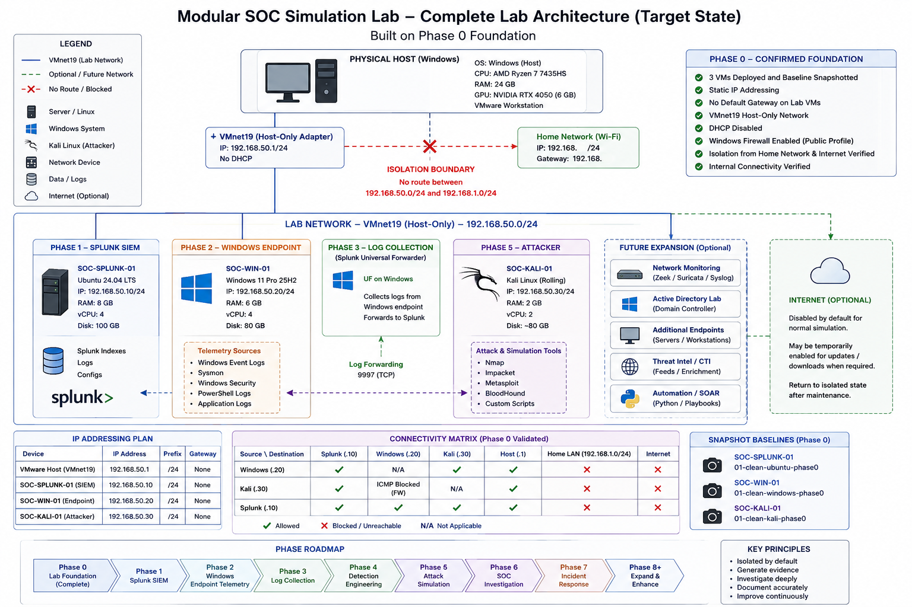

# Modular SOC Simulation Lab

  -lightgrey)

A progressively-built home SOC lab that simulates the real workflow of a Security Operations Center — from generating telemetry to detecting, investigating, and documenting security incidents.

> Aim: Build small. Generate evidence. Investigate deeply. Document accurately. Expand only when the current capability works.

## What this project demonstrates

```text
Security Event → Telemetry Collection → SIEM Ingestion → Detection →
Alert Triage → Investigation → Classification → Incident Response →
Documentation → Detection Improvement
```

The goal isn't to install a checklist of security tools — it's to show the complete analyst workflow end to end, backed by self-generated, reproducible evidence at every step.

## Progress

**Layer 1 — Infrastructure**

| Phase | Focus | Status |
|---|---|---|
| 0 | Lab Foundation | [`architecture_phase-00/architecture.md`](architecture_phase-00/architecture.md) |

**Layer 2 — Security Operations**

| Phase | Focus | Status |
|---|---|---|
| 1 | Splunk SIEM | ⬜ Planned |
| 2 | Windows Endpoint Telemetry | ⬜ Planned |
| 3 | Log Collection | ⬜ Planned |
| 4 | Detection Engineering | ⬜ Planned |
| 5 | Attack Simulation | ⬜ Planned |
| 6 | SOC Investigation | ⬜ Planned |
| 7 | Incident Response | ⬜ Planned |

**Layer 3 — Engineering**

| Phase | Focus | Status |
|---|---|---|
| 8 | Network Security Monitoring | ⬜ Planned |
| 9 | Active Directory | ⬜ Planned |
| 10 | Advanced Detection Engineering | ⬜ Planned |
| 11 | Threat Intelligence | ⬜ Planned |
| 12 | SOC Automation | ⬜ Planned |

Phases 0–6 form a complete, portfolio-ready SOC workflow on their own; Phases 7–12 extend it further.

Full phase objectives, detection standards, and documentation templates: [`docs/project-plan.md`](docs/project-plan.md)

# Architecture

### Target — Full Lab (All 13 Phases)



*Target end-state across the full roadmap — not yet fully implemented (see Progress above).*

### Current — Phase 0 (Complete)

Three isolated VMs on a dedicated VMware host-only network (`192.168.50.0/24`), fully separated from the home network — a SIEM host, a Windows endpoint, and an attacker box — with static addressing, no default gateway on any lab VM, and clean recovery snapshots for all three.


Full write-up: [`architecture_phase-00/architecture.md`](architecture_phase-00/architecture.md)

## Skills demonstrated so far (Phase 0)

- Hypervisor-based lab design (VMware Workstation)
- Network segmentation & host-only isolation
- Static IP addressing / subnetting
- Windows endpoint hardening (UEFI, Secure Boot, vTPM, host firewall)
- Snapshot / recovery-point strategy
- Technical architecture documentation

## Building toward (roadmap)

Splunk SIEM administration & SPL · endpoint telemetry (Sysmon, Windows Event Logs) · detection engineering & MITRE ATT&CK mapping · alert triage and investigation methodology · incident response · network monitoring · Active Directory · threat intel enrichment · Python automation


## Tools & Technologies

**In use:** VMware Workstation · Ubuntu Server 24.04 · Windows 11 Pro · Kali Linux

**Planned:** Splunk Enterprise · Sysmon · Suricata / Zeek · Active Directory · Python · VirusTotal / AbuseIPDB / AlienVault OTX

## Repository structure

```text
modular-soc-simulation-lab/
├── README.md
├── docs/
│   └── project-plan.md
├── architecture/
│   ├── architecture.md
│   └── network-diagram.png
├── modules/
│   ├── 00-infrastructure/       ✅ complete
│   ├── 01-splunk/
│   ├── 02-windows-telemetry/
│   ├── 03-log-collection/
│   ├── 04-detection-engineering/
│   ├── 05-attack-simulation/
│   ├── 06-investigation/
│   ├── 07-incident-response/
│   ├── 08-network-monitoring/
│   ├── 09-active-directory/
│   ├── 10-advanced-detection/
│   ├── 11-threat-intelligence/
│   └── 12-automation/
├── detections/
├── attack-scenarios/
├── investigations/
├── incident-reports/
├── scripts/
└── screenshots/
```

Folders are added only as each phase is actually implemented — not created empty in advance.

## Author

**Anuj Kumar**
*(https://linkedin.com/in/anuj-kumar-p / [https://github.com/AgreeableAK](https://github.com/AgreeableAK))*
