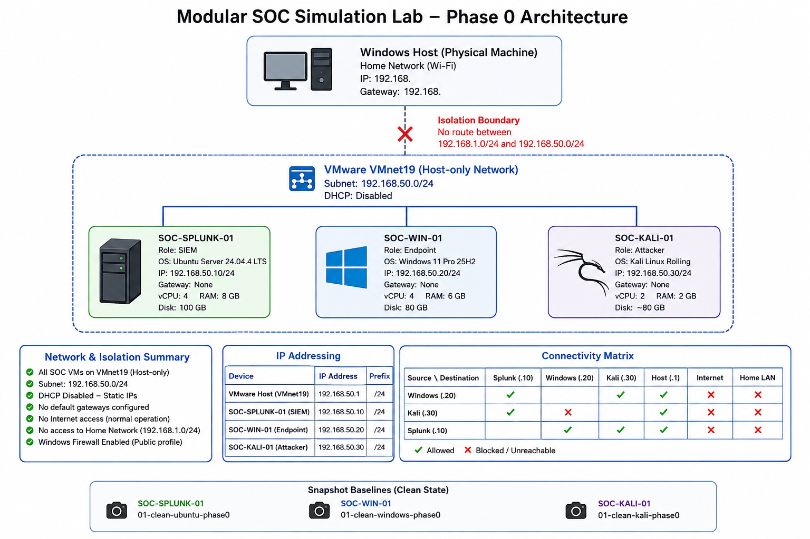

# Modular SOC Simulation Lab

## Phase 0 Architecture

**Status:** Complete\
**Hypervisor:** VMware Workstation\
**Network:** VMware VMnet19 Host-only\
**Lab Subnet:** `192.168.50.0/24`

## 1. Architecture

This lab is an isolated virtual security operations environment intentionally separated from the host's normal home network (`192.168.1.0/24`).



## 2. Physical Host & Virtual Machine Inventory

  |Component         | Specification|
  |------------------|----------------------|
  |Host OS           |Windows|
  |CPU               |AMD Ryzen 7 7435HS|
  |RAM               |24 GB|
  |GPU               |NVIDIA RTX 4050 6 GB|
  |Hypervisor        |VMware Workstation|
  |Available storage |Approximately 375 GB|
  |||


  |VM                |Role       |Operating System          |RAM         |  CPU        |Disk |Network|
  |------------------|-----------|--------------------------|------------|------------------|-----|-------|
  `SOC-SPLUNK-01`   |SIEM       |Ubuntu Server 24.04.4 LTS |8 GB      |4 vCPU      |100 GB |VMnet19
  `SOC-WIN-01`      |Endpoint   |Windows 11 Pro 25H2         |6 GB      |4 vCPU       |80 GB |VMnet19
  `SOC-KALI-01`     |Attacker   |Kali Linux 2026.02        |2 GB      |2 vCPU     |80 GB |VMnet19
 |||


## 3. Network Configuration

### VMnet19

  Setting       |Value
  ------------- |-------------------
  Network       |`VMnet19`
  Type          |Host-only
  Subnet        |`192.168.50.0/24`
  Subnet Mask   |`255.255.255.0`
  DHCP          |Disabled
  ||

- All three SOC VMs are connected to VMnet19.
- Static addressing is used to provide predictable infrastructure
addresses.


## 4. IP Addressing

  Device                |IP Address        |Prefix   |Gateway
  --------------------- |----------------- |-------- |---------
  VMware Host VMnet19   |`192.168.50.1`    |`/24`    |None
  SOC-SPLUNK-01         |`192.168.50.10`   |`/24`    |None
  SOC-WIN-01            |`192.168.50.20`   |`/24`    |None
  SOC-KALI-01           |`192.168.50.30`   |`/24`    |None
  ||

- The SOC VMs have no default IPv4 gateway during normal lab operation.


## 5. Home Network Isolation

The physical Windows host uses a separate home network:

``` text
Home network: 192.168.x.x/24
Home gateway: 192.168.x.x
```

The SOC lab uses:

``` text
SOC network: 192.168.50.0/24
```

- The SOC VMs are not configured with a default gateway toward the home
network.
- Normal attack simulation therefore remains inside the VMnet19 host-only
network.


## 6. SOC-SPLUNK-01

``` text
Hostname:         SOC-SPLUNK-01
Operating System: Ubuntu Server 24.04.4 LTS
RAM:              8 GB
CPU:              4 vCPU
Disk:             100 GB
Network:          VMnet19
IPv4:             192.168.50.10/24
Gateway:          None
```

- SSH was installed and verified during Phase 0.
- Splunk Enterprise installation belongs to a later phase.


## 7. SOC-WIN-01

``` text
Hostname:         SOC-WIN-01
Operating System: Windows 11 Pro 25H2
RAM:              6 GB
CPU:              4 vCPU
Disk:             80 GB
Network:          VMnet19
IPv4:             192.168.50.20/24
Gateway:          None
```

### Security configuration

``` text
Firmware:         UEFI
Secure Boot:      Enabled
Virtual TPM:      Present
TPM Ready:        True
Windows Firewall: Enabled
Network Profile:  Public
```

- VMware Tools were installed.
- An offline local Windows account was created during installation and further registry key modification was made to bypass minimum system requirement.


## 8. SOC-KALI-01

``` text
Hostname:         SOC-KALI-01
Operating System: Kali Linux 2026.02
Username:         kali
RAM:              2 GB
CPU:              2 vCPU
Disk:             ~80 GB
Network:          VMnet19
IPv4:             192.168.50.30/24
Gateway:          None
```


## 9. Connectivity Model

Expected normal lab communication:

``` text
SOC-KALI-01
192.168.50.30
      |
      +------> SOC-WIN-01
      |        192.168.50.20
      |
      +------> SOC-SPLUNK-01
               192.168.50.10

SOC-WIN-01
192.168.50.20
      |
      +------> SOC-SPLUNK-01
               192.168.50.10
```

The VMware host adapter is reachable at:

``` text
192.168.50.1
```

## 10. Connectivity Validation

  Source    |Destination                  |Result
  --------- |---------------------------- |----------------------------------
  Windows   |Splunk                       |PASS
  Windows   |Kali                         |PASS
  Windows   |VMware Host                  |PASS
  Kali      |Splunk                       |PASS
  Kali      |VMware Host                  |PASS
  Kali      |Windows                      |ICMP blocked by Windows Firewall
  Kali      |Home Gateway `192.168.1.1`   |Unreachable
  Kali      |Internet `8.8.8.8`           |Network unreachable
  Windows   |Home Gateway `192.168.1.1`   |Unreachable
  ||

- The Kali-to-Windows ICMP test is not considered a network failure because
Windows Firewall remains enabled and the endpoint is using the Public
network profile.


## 11. Firewall Configuration

Windows Firewall is enabled for all profiles:

``` text
Domain:  Enabled
Private: Enabled
Public:  Enabled
```

- The Windows endpoint remains on the Public network profile.
- The firewall was not disabled to achieve lab connectivity.
- This provides useful security controls for later SOC telemetry and
investigation exercises.


## 12. Isolation Controls

The lab uses the following isolation controls:

-   VMware VMnet19 Host-only networking
-   Dedicated `192.168.50.0/24` SOC subnet
-   DHCP disabled
-   Static IP addressing
-   No default gateway on SOC VMs during normal operation
-   No bridged networking for the SOC simulation network
-   Windows Firewall enabled
-   Home network on a separate subnet
-   No normal Internet route from the SOC VMs
-   No production systems used as attack targets
-   No real credentials or production data used for simulations


## 13. Snapshot Baselines

Clean baseline snapshots were created for all three VMs.

``` text
SOC-SPLUNK-01
└── 01-clean-ubuntu-phase0

SOC-WIN-01
└── 01-clean-windows-phase0

SOC-KALI-01
└── 01-clean-kali-phase0
```

- These snapshots represent the Phase 0 state before introducing the main
SOC telemetry, detection, and attack simulation components.
- They provide recovery points before major configuration changes.
